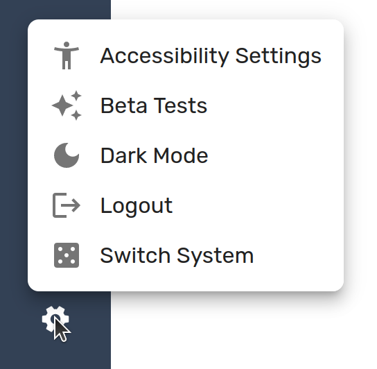

# Contributing

Any development help on this project is more than welcome!
New features should be developed in feature branches, and then will be merged into the `prod` branch to deploy to production.

New features can be gated behind feature flags until they are fully tested.
See the `src/hooks/featureFlags` folder for examples.
We can work out the details whenever you create a pull request for your work!

## Development Setup

In order to work on this app, you will need to clone this repository and run it locally.
See [SETUP.md](./SETUP.md) for instructions on how to get everything running.

## Picking Up Tickets

My todo list for this application can be found [here](https://github.com/users/scottbenton/projects/5/views/13).
If you would like to work on something that is not on that list, please open up an issue or reach out on discord so that we can discuss your proposed changes!
I don't want you spending time on something that doesn't fit with the application.
If you are new to the project, I would recommend looking for issues that are tagged with `good first issue`.
The tickets I've created are not well fleshed out, so feel free to ask any clarifying questions you have before you begin!

## Swapping between Iron Fellowship and Crew Link in development

In order to switch between the different systems while running locally, click the settings icon in the bottom left, and then click "Switch System" to swap your local environment to a different game.

## Important Libraries

- [Zustand](https://docs.pmnd.rs/zustand/getting-started/introduction) - used for storing global state across the application. I use it as an intermediary between the database and individual components
- [Firebase](https://firebase.google.com/docs) - A backend-as-a-service. Firebase provides authentication, a database, and image storage for the app, as well as a library to interact with those pieces.
- [Material UI](https://mui.com/material-ui/getting-started/) - The component library that drives the styling in this project.
- [Datasworn](https://github.com/rsek/datasworn) - rsek's incredible work that has digitized the rules of Ironsworn games and allows for easy interactions between them.

## File Structure & Organization

This project has grown a lot further than I originally intended. Because of that, its a lot messier than I intended. However, I try to generally follow this structure in order to keep a little bit of the chaos contained.

### Data Flow

Our data is stored in a Firestore instance. This database is built for real-time sync applications such as ours, and most of the connections in our app need to reflect this. A transaction with the database to fetch data is often not a one-time call, but instead keeps a websocket connection open in order to continually fetch the latest updates from the firebase backend.

In order to organize the flow of data, we keep all of our interactions with Firestore in the `api-calls` directory. Every function that we write that interacts with the database should go in here.

From there, we need to organize the data we receive (and the mutations we can call to update it) in a single spot. In order to do this, we write a zustand state slice `stores/*`. From within this slice, we handle organizing, grouping, and exposing actions to the rest of the UI.

Once our data is organized, we can begin to use it on the frontend. We often need to create and call a listener hook (ex: [useListenToNPCs](src/stores/world/currentWorld/npcs/useListenToNPCs.ts)) in order to get the data populated into zustand. From there, we can begin to consume data from the store, and dispatch actions back through the store in order populate our UI and update the database with changes.

### File Organization

Try your best to abide by the following "organization", but don't let it worry you! I certainly haven't perfectly followed it either! If I see anything too far off I'll throw up a comment on a pull request!

| Folder     | Purpose                                                                                                                                                                                                                                           |
| ---------- | ------------------------------------------------------------------------------------------------------------------------------------------------------------------------------------------------------------------------------------------------- |
| api-calls  | Handles organizing firestore read & write operations                                                                                                                                                                                              |
| assets     | Stores static assets (like icons) that are used across the app                                                                                                                                                                                    |
| components | Stores components & hooks that are not specific to one page - generic components are kept under `components/shared`, while components that relate to a specific feature are under `components/features`                                           |
| config     | Exports configuration needed for third-party libraries                                                                                                                                                                                            |
| data       | Organizes and re-exports data from the datasworn library in a way that works well for our applications                                                                                                                                            |
| functions  | Helper functions that aren't react-specific should go here                                                                                                                                                                                        |
| hooks      | Custom react hooks should go here. If the hook deals with logic that is specific to a certain component or a certain part of the application, it might be better suited to be stored with that component. Use your best judgement!                |
| lib        | Similar to config, contains a few functions needed for third-party libraries                                                                                                                                                                      |
| pages      | Each page in our apps has a component here. If that page contains components that are only needed for that page, those should be contained here as well. If the component is needed across pages, the `components` folder should be used instead. |
| providers  | A few React context providers. ThemeProvider houses the theme variables for the application                                                                                                                                                       |
| stores     | Configuration for zustand. Contains the main global data store for this application                                                                                                                                                               |
| types      | Typescript typings for different features & database objects                                                                                                                                                                                      |

## Getting Help

I am **always** happy to help troubleshoot issues and guide development that you are working on!
Feel free to reach out to me here, or on Discord (username: scottbenton) for help.
