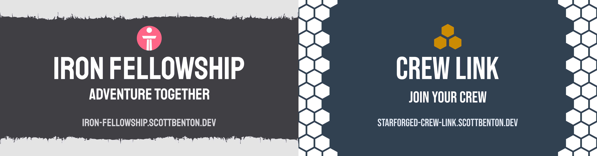
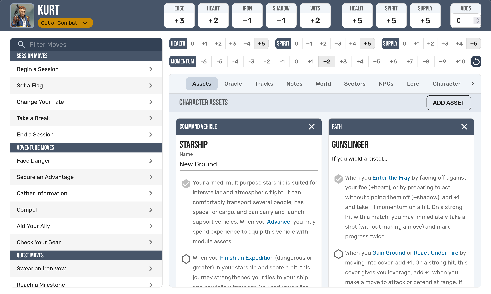
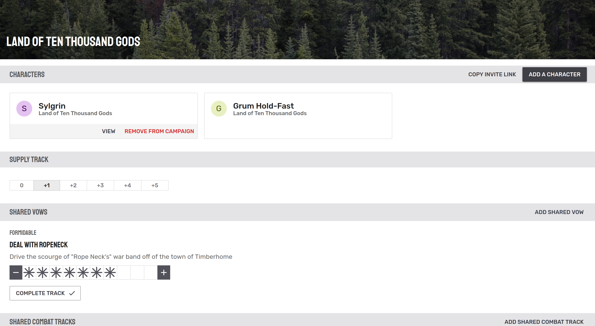
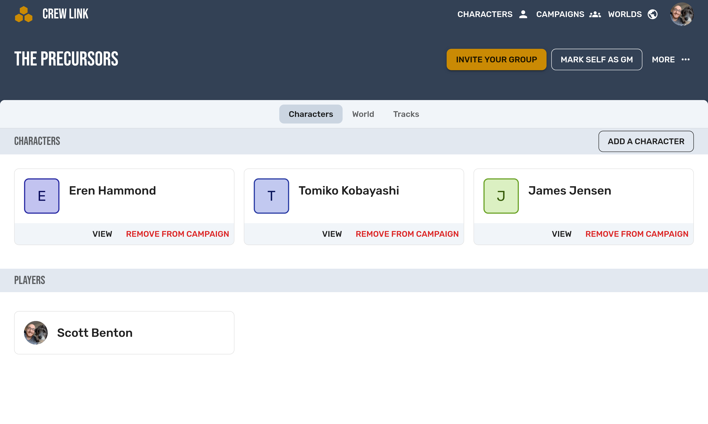

[Iron Fellowship](https://iron-fellowship.scottbenton.dev) | [Crew Link](https://starforged-crew-link.scottbenton.dev/)

Welcome! Iron Fellowship and Crew Link are applications for anyone playing the Tabletop RPGs [Ironsworn or Starforged](https://www.ironswornrpg.com/) to use.
Featuring clean character sheets, campaigns with shared assets and tracks, and cloud sync across all your devices.

## Features

### Character Sheet

- Quickly view your characters stats.
- View moves, oracles, and use the built in dice roller to determine success or failure.
- View and update your character's assets, even creating your own custom asset cards.
- Update personal and shared tracks.
- Share a supply track with other members of your campaign.
- Write notes
- Keep track of locations, NPCs, and lore within your world

### Campaigns

- Share a supply track, vows, and more with your party.
- Keep shared notes by adding a world to your campaign
- Invite new players to your campaign with a simple invite link.

### GM Screen

- Keep track of your character's stats and assets
- Run combat, or update group progress tracks
- Keep detailed session notes
- Add hidden NPCs or Locations that you can make visible when your party goes somewhere new

### Future Changes

There is more to come for Iron Fellowship and Crew Link.
We have lots of items on the backlog, which you can view [here](https://github.com/users/scottbenton/projects/5).
To suggest changes and give feedback, you can chime in on existing issues or create new ones [here](https://github.com/scottbenton/Iron-Fellowship/issues).
Keep checking back!

## Thanks

Thank you to...

- Everyone who has contributed code to Iron Fellowship
- Shawn Tomkin for the permissive license on his game, Ironsworn
- GCoulby for creating [Ironsworn Companion](https://github.com/gcoulby/IronswornCompanion), and allowing me picks his brain, use his code, and steal assets to use in this app
- RSek for creating [Datasworn](https://github.com/rsek/datasworn), which this project uses

## Contributing

[See CONTRIBUTING.MD](./CONTRIBUTING.md)

## Licensing

### Ironsworn

This work is based on [Ironsworn](https://www.ironswornrpg.com), created by Shawn Tomkin, and licensed for our use under the [Creative Commons Attribution-NonCommercial-ShareAlike 4.0 International license.](https://creativecommons.org/licenses/by-nc-sa/4.0/)

### Starforged

This work is based on [Ironsworn: Starforged](https://www.ironswornrpg.com), created by Shawn Tomkin, and licensed for our use under the [Creative Commons Attribution-NonCommercial-ShareAlike 4.0 International license.](https://creativecommons.org/licenses/by-nc-sa/4.0/)
