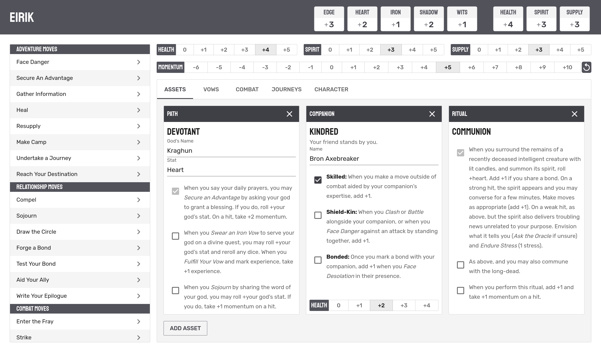

# Iron Fellowship

Welcome! Iron Fellowship is an application for anyone playing the Tabletop RPG [Ironsworn](https://www.ironswornrpg.com/) to use.
Featuring a clean character sheet, campaigns with shared assets and tracks, and cloud sync across all your devices.

## Features

### Character Sheet



- Quickly view your characters stats.
- View moves, and use the built in dice roller to determine success or failure.
- View and update your character's assets, even creating your own custom asset cards.
- Update personal and shared tracks.
- Share a supply track with other members of your campaign.

### Campaigns


- Share a supply track, vows, and more with your party.
- Invite new players to your campaign with a simple invite link.

### Future Changes

There is more to come for the Iron Fellowship.
Note keeping, NPCs, Combat Tracking, and Oracle tables are on the backlog, which you can view [here](https://github.com/users/scottbenton/projects/5).
To suggest changes and give feedback, you can chime in on existing issues or create new ones [here](https://github.com/scottbenton/Iron-Fellowship/issues).
Keep checking back!

## Thanks

Thank you to...

- Everyone who has contributed code to Iron Fellowship
- GCoulby for creating [Ironsworn Companion](https://github.com/gcoulby/IronswornCompanion), and allowing me picks his brain, use his code, and steal assets to use in this app
- RSek for creating [Datasworn](https://github.com/rsek/datasworn), which this project uses

## Development

Any development help on this project is more than welcome!
New features should be developed in feature branches, and then merged into the `dev` branch to deploy to our [development environment](https://dev.iron-fellowship.scottbenton.dev). Once our dev branch is at a point where everything looks good to ship, we can merge into the `prod` branch to deploy to our production environment.

### Setup

1. Clone this project `git clone https://github.com/scottbenton/Iron-Fellowship.git`
1. Install dependencies `npm i`
1. Set up firebase (see Firebase Setup below)
1. Run `npm run dev` and go to your browser to see the output.

### Firebase Setup

Firebase provides authentication, database, and image storage to this application.

The first step is to create a firebase project. You can do this by going to the [firebase console](https://console.firebase.google.com/). Once you have created a project, you will need to register a web app.


In order to run the application locally, you will need to set up a `.env.local` file with the information firebase needs to connect to these services.

Once registered the web app, it will give you a config object. Copy the values from this object into your `.env.local` file in the following properties:

```
VITE_FIREBASE_APIKEY=
VITE_FIREBASE_AUTHDOMAIN=
VITE_FIREBASE_PROJECTID=
VITE_FIREBASE_STORAGEBUCKET=
VITE_FIREBASE_MESSAGINGSENDERID=
VITE_FIREBASE_APPID=
```

Also remember to enable Google Authentication as provider in your firebase project. You can do this by going to the Authentication tab in the firebase console.
